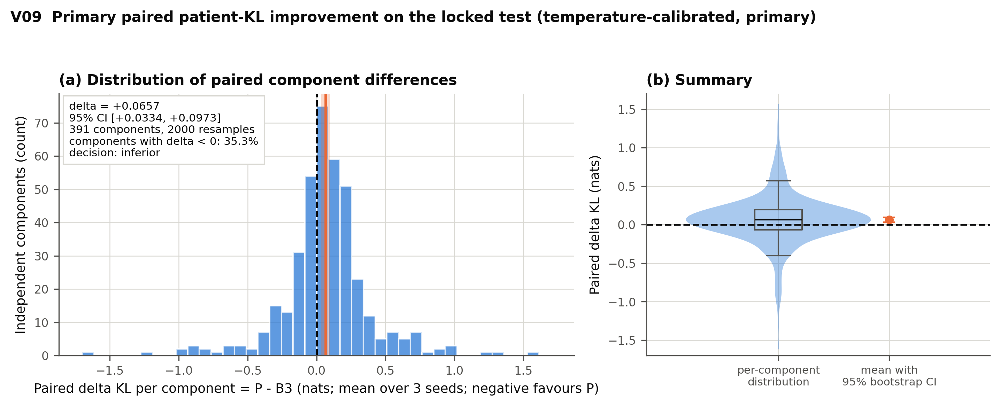
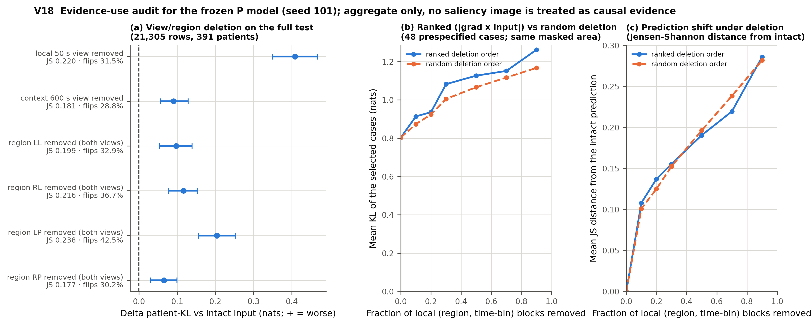
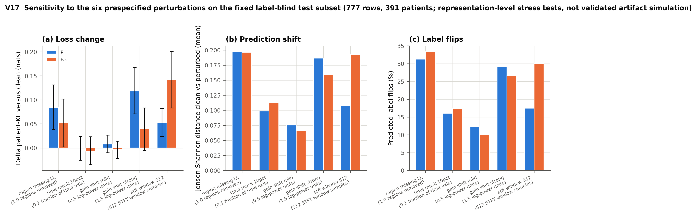
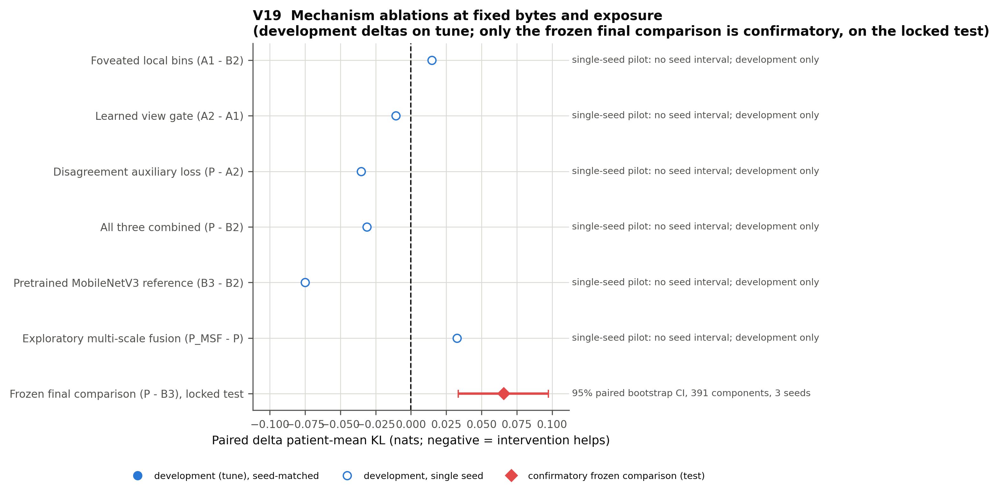
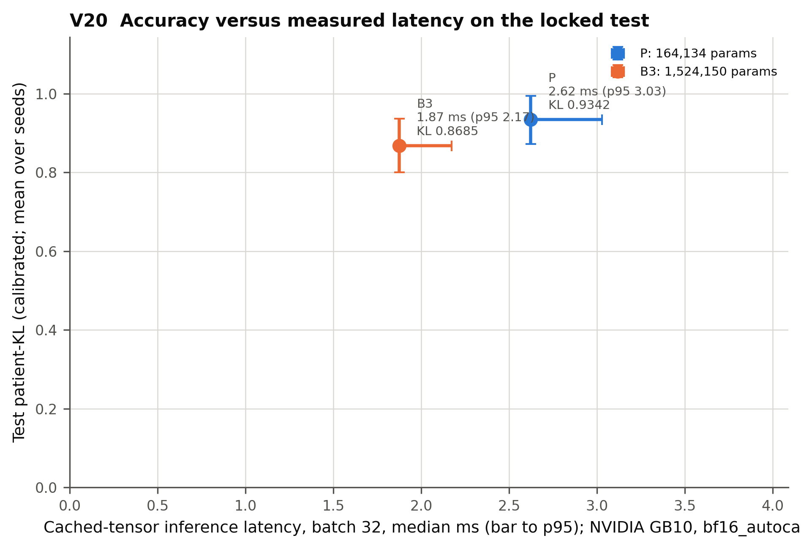
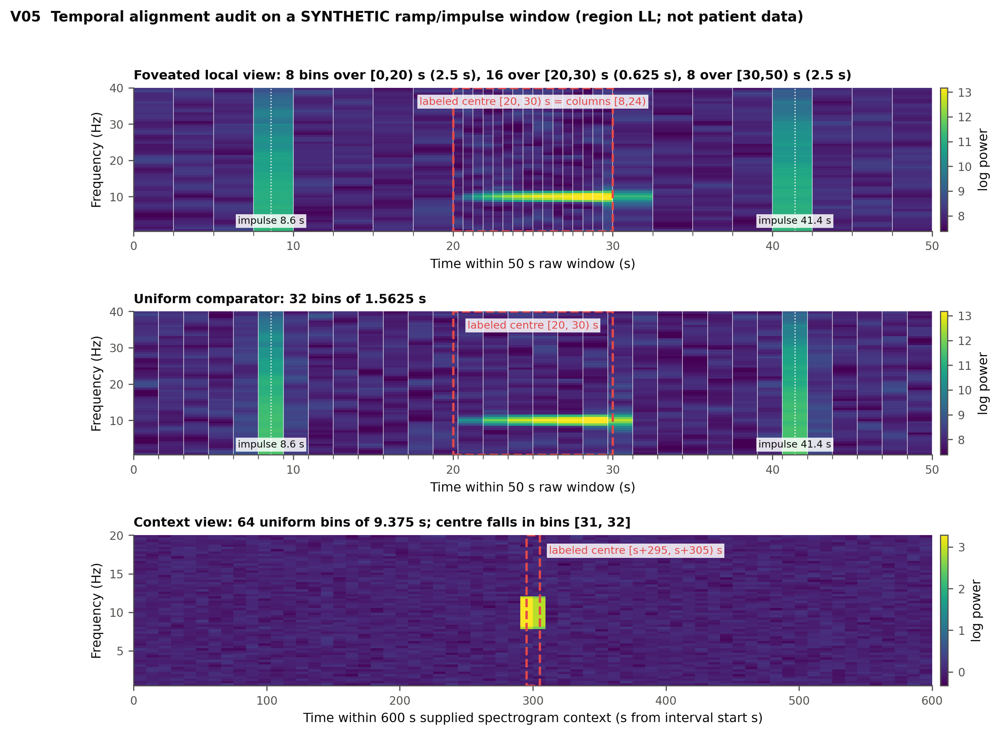
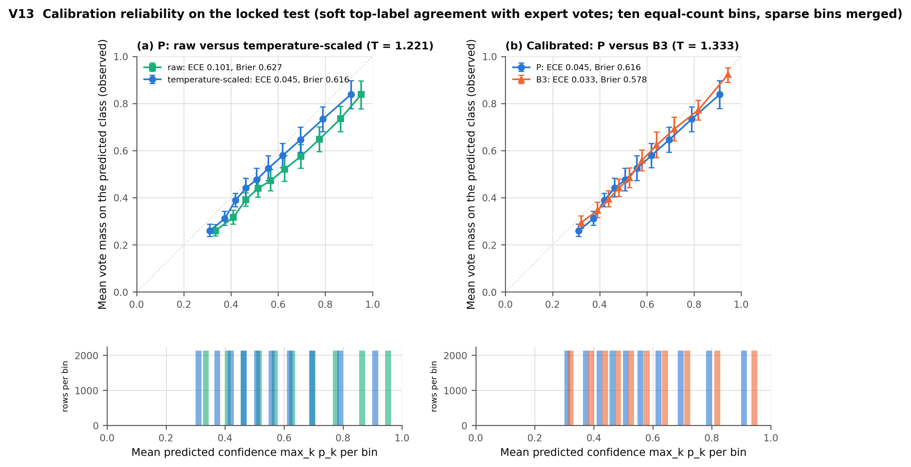

# CAPE-EEG

**Byte-budgeted foveated spectrogram learning with expert-disagreement audits on HMS harmful brain activity EEG**

A fully pre-registered, single-GPU study of six-class expert-vote prediction (seizure, LPD, GPD, LRDA, GRDA, other) on the HMS Harmful Brain Activity Classification data, executed end to end on one NVIDIA DGX Spark (GB10) in **0.72 GPU-hours**. The repository contains the complete pipeline, seven executed notebooks, 147 synthetic tests, 20 audited figures and every aggregate result. Patient-level artefacts and the data itself are not redistributed (see `DATA_ACCESS.md`).

> Research only. Nothing here is a clinical device, a seizure-onset detector, or a validated decision aid.

## Headline result (locked test, 391 held-out patients, 21,305 labelled windows)

The pre-registered hypothesis was that the compact foveated-gate candidate **P** (164,134 parameters) beats the strongest small comparator on patient-mean KL divergence to the expert-vote distribution. It does not. The comparator selected on tune data was an ImageNet-pretrained **MobileNetV3-Small** (1,524,150 parameters) on exactly the same cached evidence.

| Method | Params | Patient-mean KL (3 seeds, mean ± sd) | Row-mean KL | Macro AUROC | Balanced acc. | Soft ECE |
|---|---:|---:|---:|---:|---:|---:|
| B3 MobileNetV3-Small (comparator) | 1,524,150 | **0.869 ± 0.011** | **0.807** | **0.884** | **0.576** | **0.036** |
| P CAPE-EEG candidate | 164,134 | 0.934 ± 0.018 | 0.906 | 0.857 | 0.523 | 0.051 |
| P+MSF (exploratory multi-scale fusion) | 208,070 | 0.958 ± 0.011 | 0.925 | 0.849 | 0.506 | 0.040 |

Primary estimand, temperature-calibrated predictions, paired over 391 independent patients with 2,000 bootstrap replicates:

**Δ patient-mean KL (P − B3) = +0.066, 95% CI [+0.033, +0.097] → the candidate is inferior.** The uncalibrated secondary estimate agrees (+0.049 [+0.006, +0.090]).

All numbers are natural-log KL over *all* labelled windows, including single-annotator rows; KL restricted to windows with ≥ 10 votes is 0.666 (B3) versus 0.744 (P).



## What the study establishes

1. **A reproducible, leak-free benchmark protocol.** Patient/recording connected-component split 60/10/5/5/20 (seed 20260907), zero cross-partition overlap, a 5.58 GB float16 cache with bit-packed validity masks built in 13 minutes, train-only normalisation, a written protocol lock before any test access, one test evaluation, and a complete GPU ledger (17 jobs, 0 failures, 0.72 h of the 12 h ceiling).
2. **A matched mechanism study that returns a clean negative.** At identical bytes, trunk, schedule and augmentation, foveating the 50 s local view (A1 vs B2), learning the local/context mixture (A2 vs A1) and adding the disagreement auxiliary loss (P vs A2) change tune patient-KL by +0.015, −0.011 and −0.007 respectively: none is a practically meaningful gain. The economical multi-scale fusion block (P+MSF) is worse on the locked test (+0.024 versus P, CI [+0.001, +0.045]).
3. **The candidate really uses the evidence it claims to use.** Deleting the raw-EEG local view raises P's test KL by +0.41, deleting the 10-minute context by +0.09; the left-parasagittal region matters most (+0.20). Saliency-ranked deletion degrades the prediction faster than random deletion at every fraction (at 30 % removed: KL 1.08 vs 1.01).
4. **Robustness is mixed and honest.** Under a changed STFT window (256 → 512 samples) P degrades by +0.05 KL while the pretrained comparator degrades by +0.14; under a strong +1.5 log-power gain shift the picture reverses (+0.12 vs +0.04). Both models lose ~0.05–0.08 when the left-lateral chain is removed.
5. **Calibration and review prioritisation.** Both models are over-confident before scaling (temperatures 1.2–1.4 on calibration-T). With entropy as the frozen referral score and thresholds fixed on calibration-P, referring 11.8 % of test windows lowers accepted-case patient KL from 0.923 to 0.911 for P. The disagreement head predicts observed annotator disagreement with Spearman 0.31 overall (0.23–0.24 within vote-count strata), too weak to beat entropy as a referral score.
6. **Resource accounting.** A final fit takes ~1.1 min; peak CUDA allocation 0.44 GiB; cached-tensor inference 1.4 ms (batch 1) / 2.6 ms (batch 32) for P and 1.5 / 1.9 ms for B3; raw Parquet-to-prediction ~45 ms per window (I/O-bound).

The reading for a conference paper: with a fair, byte-matched and leak-free protocol, a small ImageNet-pretrained CNN remains a strong low-resource baseline for expert-vote EEG classification, and the three proposed compact mechanisms do not close the gap. The auditing machinery (evidence deletion, prespecified corruption suite, calibration, referral analysis, seed spread) is the reusable contribution.


## Figure gallery (all twenty in `figures/`, each with a provenance sidecar)

| | |
|---|---|
|  |  |
|  |  |
|  |  |

## Development evidence (tune partition, seed 101, patient-mean KL)

| ID | Configuration | Params | Best tune KL | Schedule |
|---|---|---:|---:|---|
| B0 | training-set vote prior | 0 | 1.410 | – |
| B1 | band-power soft logistic regression (CPU) | 450 | 1.241 | LBFGS |
| B2 | compact trunk, uniform bins, fixed 50:50 fusion | 147,524 | 0.986 | 12 ep (best ep 2) |
| A1 | B2 + foveated bins | 147,524 | 1.001 | 12 ep (best ep 2) |
| A2 | A1 + learned gate | 155,877 | 0.990 | 12 ep (best ep 1) |
| P | A2 + disagreement auxiliary | 164,134 | 0.983 | 12 ep (best ep 2) |
| P+MSF | P with multi-scale fusion block | 208,070 | 0.988 | 12 ep (best ep 1) |
| B3 | MobileNetV3-Small, 4-channel, ImageNet | 1,524,150 | 0.896 | 12 ep (best ep 3) |
| P (pilot 7) | complete 3-epoch cosine schedule | 164,134 | 0.927 | 3 ep |
| B3 (pilot 8) | complete 3-epoch cosine schedule | 1,524,150 | 0.927 | 3 ep |

Every model overfits patient-specific structure after two or three epochs, so the two allowed *common shorter schedule* pilots (configurations 7 and 8 of the eight permitted) were run and the 3-epoch complete schedule was frozen for the final refits on train+tune. On tune the two methods tie under that schedule; on the locked test they do not.

## Paper (NSysS 2026)

The study is written up as a nine-page ACM-format manuscript for the 13th International Conference on Next Generation Computing, Communication, Systems and Security (NSysS 2026): [`paper/CAPE-EEG_NSysS2026_author_version.pdf`](paper/CAPE-EEG_NSysS2026_author_version.pdf) (author version), [`paper/CAPE-EEG_NSysS2026_submission_anonymous.pdf`](paper/CAPE-EEG_NSysS2026_submission_anonymous.pdf) (double-blind submission) and the full LaTeX source in [`paper/CAPE-EEG_NSysS2026_latex_source.zip`](paper/CAPE-EEG_NSysS2026_latex_source.zip). See `paper/README.md` for the build instructions.

## Full evaluation report

All metrics, subgroup, robustness, evidence, resource tables and the rubric rating are in [`EVALUATION_REPORT.md`](EVALUATION_REPORT.md).

## Repository map

```
configs/study.yaml            resolved study configuration (no secrets)
src/cape_eeg/                 contracts, data (inventory, montage, alignment, spectral, cache, splits,
                              normalization, dataset), model, baselines, training, evaluation, visualization, release
scripts/                      audit_source, make_splits, build_cache, train, predict, run_baselines_cpu,
                              evaluate_dev, final_evaluate, make_figures, release_precheck, publish, drivers
notebooks/                    seven thin notebooks; notebooks/executed/ holds executed copies with aggregate-only outputs
tests/                        147 CPU synthetic tests (pytest)
docs/                         the eight authoritative planning documents (01–08)
results/aggregate/            five tables + final_evaluation_summary.json (sanitised, no identifiers)
figures/                      V01–V20 (PNG 300 dpi + SVG) with provenance sidecars and manifest.json
refs/REFERENCES.md            source register S01–S13
```

## Reproduce

```bash
export HMS_DATA_ROOT=/path/to/hms   # train.csv, train_eegs/, train_spectrograms/
export CAPE_ROOT=/path/to/workspace # will hold private/ (never committed)
pip install -e .                    # or: numpy pandas pyarrow scipy scikit-learn torch timm matplotlib safetensors papermill
python -m pytest -q                 # 147 synthetic tests, CPU only
python scripts/audit_source.py && python scripts/make_splits.py
python scripts/build_cache.py --smoke 64 && python scripts/build_cache.py
bash scripts/run_dev_pipeline.sh                      # B0–B3, A1, A2, P, P+MSF on train → tune
CONFIGS="P B3" EPOCHS=3 TAG=ep3 bash scripts/run_dev_pipeline.sh   # the two schedule pilots
python scripts/evaluate_dev.py --schedule-epochs 3 --lock          # freeze the protocol
EXPLORATORY=P_MSF bash scripts/run_final_pipeline.sh  # 9 final fits + one locked evaluation
python scripts/make_figures.py
```

Or run the notebooks in order (`bash scripts/run_notebooks.sh`). Hashes to verify a rebuild: split `4455edaac7cb7e5d`, preprocess `2406ce595fbd7457`, cache `af515c778666c076`, protocol `380269a4a6db7334`.

## Method summary

* **Inputs.** Local view: the 50 s raw EEG window → 16 bipolar leads in four regional chains (LL, RL, LP, RP) → Hann STFT (256/64/256) → linear power averaged over valid leads → 64 frequency bins 0.5–40 Hz × 32 time bins, with half the bins on the labelled centre [20, 30) s (foveated) or equal widths (uniform control) → log. Context view: the supplied 10-minute spectrogram → 4 regions × 64 frequency × 64 time bins → log. Validity masks are stored as bits; invalid cells are zero after normalisation and enter the gate as valid-fraction features.
* **Model.** Separate 3×3 stems per view, shared depthwise-separable trunk 24→48→64→96→128 with GroupNorm, mean/max/centre pooling for the local view and mean/max for the context view, independent six-way heads, a learned mixture gate `g = σ(MLP[u_L, u_C, valid_L, valid_C, JS(p_L, p_C)])`, and a disagreement head trained on the observed pairwise annotator-disagreement statistic (n > 1 only, weight 0.1).
* **Training.** AdamW, lr 1e-3 (backbone 1e-4 / head 1e-3 for the pretrained comparator, one frozen epoch), weight decay 0.01, cosine schedule with 200 warm-up steps, batch 64, bf16 autocast after a parity smoke test (max |Δp| = 0.005), gradient clip 1.0, mild gain jitter, ≤ 4-bin frequency masking and 10 % single-region dropout. Softmax, KL and all metrics in float32/64.
* **Evaluation.** KL(q‖p) with p clipped at 1e-7, patient-equal weighting, three fixed seeds averaged as losses (not an ensemble), scalar temperature on calibration-T, referral thresholds on calibration-P, and the prespecified subgroup, corruption, evidence-deletion, latency and resource analyses of `docs/04`.

## Limitations

Single dataset and site; segment labels only (no event-level, onset or false-alarm metrics); the disagreement statistic assumes exchangeable annotators; the six corruption conditions are representation-level perturbations, not validated artefact simulators; single-annotator windows (4 % of rows) have unavoidably noisy targets; weights are withheld pending a data-rights review; no external or prospective validation.

## Citation

See `CITATION.cff`. Source register and all cited 2025–2026 preprints: `refs/REFERENCES.md`.

## License

MIT (code). The HMS data remain under the Kaggle competition's terms and are not redistributed.
